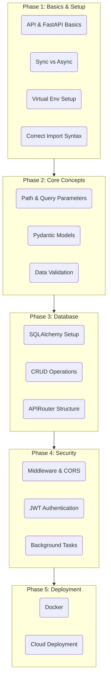

# FastAPI Roadmap (My Notes)

## Existing Notes
- [What is an API?](Lecture_1_What_is_an_API/notes.md)
- [FastAPI Basics](Lecture_2_FastAPI_Basics/notes.md)
- [How to start virtual env in Macbook](How_to_start_virtual_env_macbook/notes.md)
- [Correct API Import Syntax](How_to_import_API_correct_syntax/notes.md)
